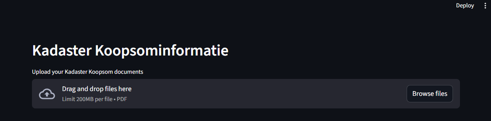
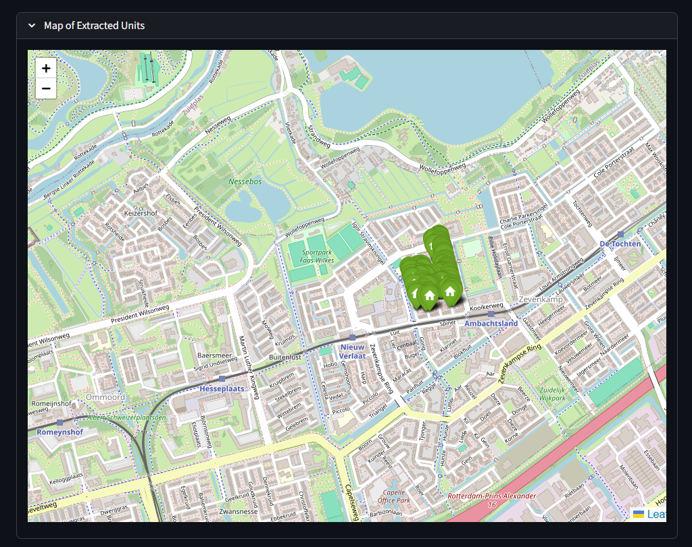
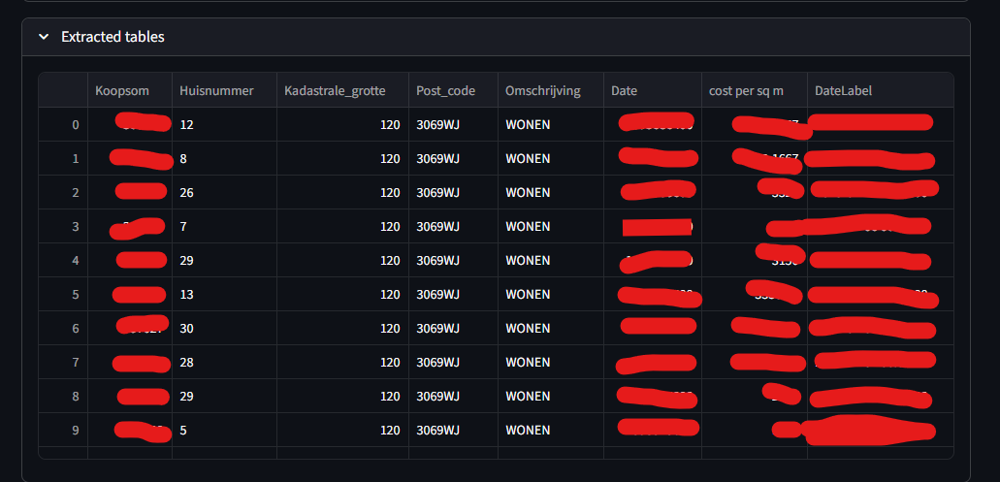
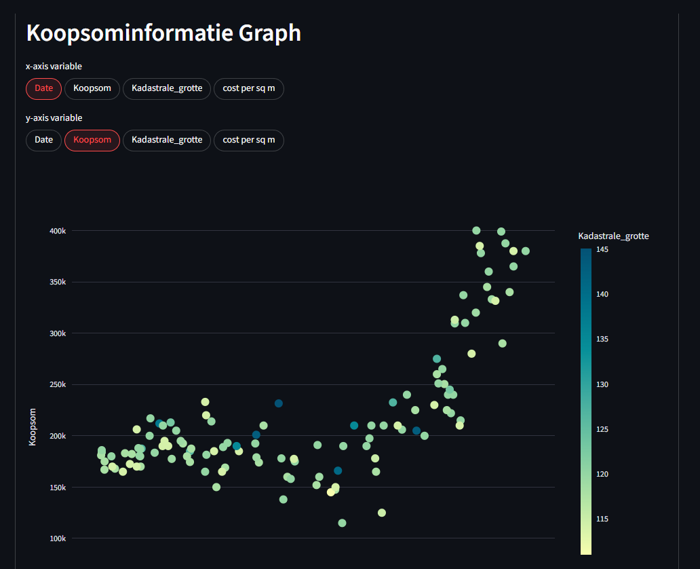
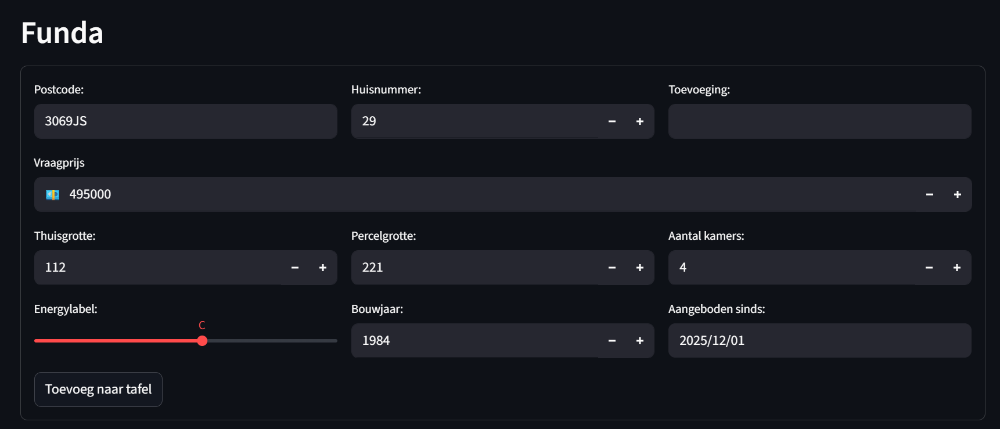
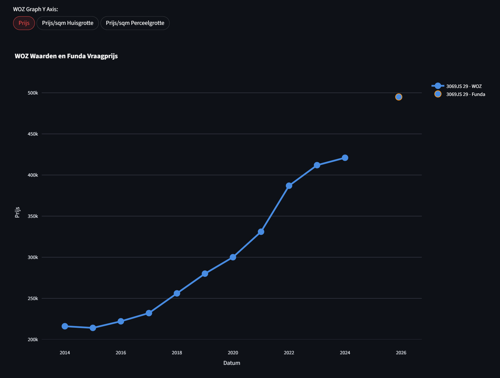
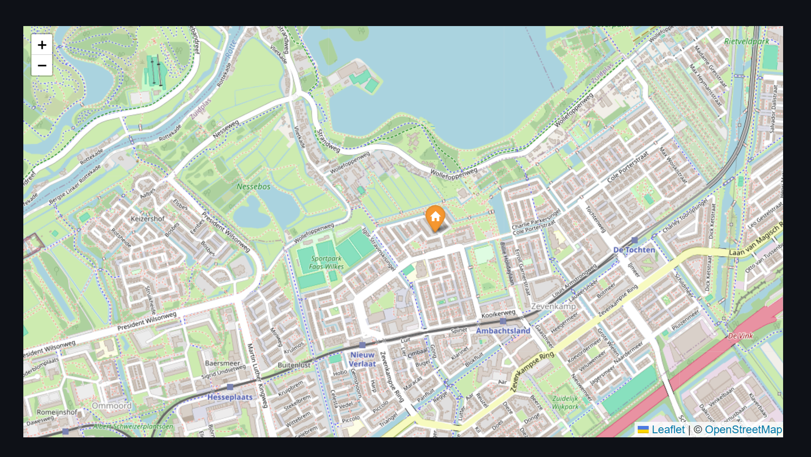

# Huisjager

House hunting tool made with Streamlit for aggregating real estate information in the Netherlands

***

## What's this?

This Streamlit tool is made for aggregating real estate market information in the Netherlands. 

The tool does several things:

1. Converts Kadaster Koopsominformatie PDFs into a table of home sale information. 
2. Has a form for adding Funda real estate listings with basic metadata
3. Scrapes WOZ Waarde data for address valuations

The tool also includes a very basic mapping function by requesting geocoding information from the Kadaster Adres API. It will also display WOZ Waarde data over time. 

## How to use

Directions here for Linux based systems, might also work on MacOS. 

Clone the repo locally

    git clone https://github.com/gspeed0689/huisjager.git

Change directory into the repository and create a venv. I have joined team `uv`, so the directions below are for uv. 

    cd huisjager
    uv sync

If you don't use UV, I think you can also run this instead. I say the pip install route with an edit flag because I know there are some issues that need to be fixed. 

    pip install -e .

Activate your virtual environment. 

Start the tool with by changing directory into the sub `huisjager` folder. 

    cd huisjager
    streamlit run 0_🏘️_Huisjager.py

Open your browser to localhost:8501

### Koopsominformatie section

At the top of the app is a Koopsominformatie processing tool, where you can download Koopsominformatie PDFs from Kadaster. 

⚠️Known limitation: When I was searching for a house, I did not purchase any Koopsominformatie PDFs with Huisnummer and Toevogeing, so the app might throw an error. 

You can drag and drop the PDFs or click to browse for your files. 

A map will appear below with the extracted information from the PDFs. 

Below that is a table of the extracted data, I crossed through the "proprietary" Kadaster data. 

And below that is a graph to compare the different data points from the extracted tables. 

Wow, look at how house prices have exploded. 

### Funda Section

Next is the Funda section where you can copy and paste information from a Funda listing, and the app will grab WOZ Waarde data and format it into a nice table. 

The app will then grab the WOZ data and put it into a graph, where it will show the WOZ history as a line, and a single data point for the current Funda asking price. There are also options to change visualization. 

And of course it will map the house location. 

